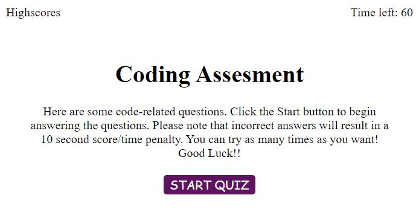

# Web-APIs-Code-Quiz

AS A coding boot camp student
I WANT to take a timed quiz on JavaScript fundamentals that stores high scores
SO THAT I can gauge my progress compared to my peers.

## Table of contentens

* [Description](#Description)
* [Instructions](Instructions)
* [Instalation](#Instalation)
* [Mock-Up](#Mock-Up) 

## Description

- In this repository I modified the starter code to create an application that enables employees to generate random passwords based on criteria that they’ve selected.
- Following the requirements, I created the code in JavaScript trying to have a clean and polished, responsive user interface that adapts to multiple screen sizes.
- I commented each step creating the code for futures developers understand.

## Instructions

- The first view of the application displays a button that starts the quiz.
- Clicking the start button displays a series of questions.
- Once the quiz begins, a timer starts.
- If a question is answered incorrectly, additional time is subtracted from the timer.
- The timer stops when all questions have been answered or the timer reaches 0.
- After the game ends, the user can save their initials and score to a highscores view using local storage.

## Instalation
- [Link to Github Profile](https://github.com/Lauracejas)

- [Link to deployed website](https://lauracejas.github.io/Web-APIs-Code-Quiz/)

## Mock-Up

